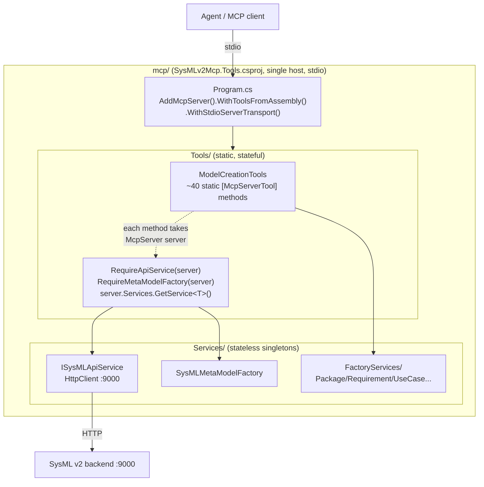
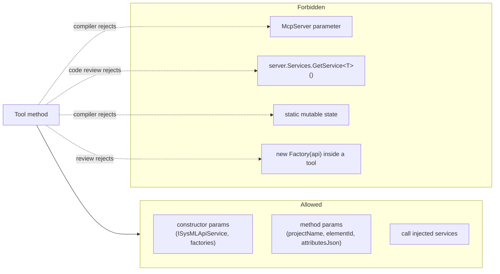

# AGENTS.md

Guidance for opencode agents (and human contributors) working in this repo.
It covers the build/test commands, the current architecture, and the target
**stateless-core** architecture the codebase is migrating toward.

---

## Build, test, run

| Task | Command |
|---|---|
| Restore | `dotnet restore` |
| Build | `dotnet build --no-restore` |
| Run unit tests (no integration) | `dotnet test --no-build --filter "Category!=Integration" --verbosity normal` |
| Run server under debugger | Open `mcp/Src/Program.cs` in VS Code, press **F5** |

The SysML v2 backend must be reachable at `http://localhost:9000` for any
tool that hits the API. The CI workflow (`.github/workflows/dotnet.yml`)
runs the same build + filtered test commands.

---

## Repository layout

```
mcp/                          ← MCP server + shared tool library (SysMLv2Mcp.Tools.csproj)
└── Src/
    ├── Program.cs            ← all-tools host composition root (DI + stdio transport)
    ├── Tools/
    │   ├── ModelCreationTool.cs   ← current home of remaining static [McpServerTool] methods
    │   ├── AbstractTool.cs        ← deprecated base class for tool sets
    │   ├── Projects/              ← stateless instance tool classes (migration target)
    │   │   └── ProjectTools.cs
    │   └── Creation/             ← earlier per-domain WIP layout (being replaced)
    ├── Services/
    │   ├── ISysMLApiService.cs / SysMLApiService.cs   ← HTTP client to :9000
    │   └── FactoryServices/      ← domain factories (package, requirement, …)
    ├── Models/                  ← DTOs returned to the LLM
    └── Resources/               ← embedded resources
Hosts/                        ← per-domain thin MCP server hosts
└── Projects/                 ← SysMLv2Mcp.Projects.csproj (mounts only ProjectTools)
    └── Program.cs
test/SysMLv2Mcp.Tests/        ← xUnit tests (SysMLv2Mcp.Tests.csproj)
SysMLv2Mcp.sln               ← solution (mcp + Hosts/Projects + test)
sysmlv2-api-spec/             ← SysML v2 metamodel JSON used by schema tools
sysml-v2-client/              ← generated API client
```

---

## Current architecture (as of this commit)

- **Host**: `WebApplication` in `Program.cs`. Registers MCP with
  `AddMcpServer().WithToolsFromAssembly().WithStdioServerTransport()`.
- **Tools**: ~40 `static` methods on `ModelCreationTools`, each tagged
  `[McpServerTool]`. Every method takes `McpServer server` as its first
  parameter and resolves collaborators via private helpers:
  ```csharp
  private static ISysMLApiService RequireApiService(McpServer server)
      => server.Services?.GetService<ISysMLApiService>()
         ?? throw new Exception("ISysMLApiService is not registered.");
  ```
  This is the **stateful coupling** the migration removes.
- **Services**: `ISysMLApiService` (HttpClient-based), `SysMLMetaModelFactory`,
  and per-domain factories are registered as DI singletons in `Program.cs`.
  They hold no per-session state today; the leakage is in the tool layer.
- **Factories**: `SysMLPackageFactory`, `SysMLRequirementFactory`,
  `SysMLUseCaseFactory`, `SysMLOpenApiFactory` encapsulate commit payload
  construction and call `apiService.CommitToBranchAsync(…)`.

---

## Target architecture: stateless core (MCP stateless-server pattern)

The MCP protocol now supports a **stateless core**: the server holds no
per-request session state and every tool invocation carries all the
context it needs. This enables horizontal scaling and transport-agnostic
hosting (stdio today, HTTP/SSE later) without rewriting tools.

We adopt **Pattern 1: Stateless tools + DI services**.

### Rules

1. **Tools are pure functions over their parameters + injected services.**
   - No `McpServer` parameter. No `server.Services.GetService(…)` inside a
     tool. No static state.
   - Per-call inputs (project name, branch id, element id, attribute JSON)
     arrive as method parameters only.
   - Collaborators (`ISysMLApiService`, `SysMLMetaModelFactory`,
     per-domain factories) are constructor-injected into the tool class and
     resolved by DI, never pulled from `McpServer` at call time.

2. **Tool classes are concrete, non-static, and DI-registered.** Replace the
   current `public static class ModelCreationTools` with instance classes
   that declare their dependencies via the constructor:
   ```csharp
   [McpServerToolType]
   public class ProjectTools(ISysMLApiService api)
   {
       [McpServerTool, Description("…")]
       public ProjectLookupResult GetProjectByName(string projectName)
       {
           var project = api.GetProjects().GetAwaiter().GetResult()
               .FirstOrDefault(p => p.Name == projectName);
           return ProjectLookupResult.From(project);
       }
   }
   ```
   `WithToolsFromAssembly()` still discovers them; DI satisfies the
   constructor. The framework permits instance tool classes — use them.

3. **Services stay singletons but remain stateless.** `ISysMLApiService`,
   `SysMLMetaModelFactory`, and factory classes may cache *immutable*
   metadata (e.g. the metamodel JSON loaded once at startup) but must not
   store per-session/per-request data. If you need request-scoped state
   (auth headers, trace id), pass it as a parameter, not service state.

4. **One tool class per domain, not one mega-class.** Split
   `ModelCreationTool.cs` (~724 lines) into:
   `ProjectTools`, `ElementQueryTools`, `SchemaTools`, `PackageTools`,
   `RequirementTools`, `UseCaseTools`, `SignalTools`, `BlockTools`,
   `InterfaceTools`, `ElementMutationTools`. Each lives under
   `mcp/Src/Tools/<Domain>/` and matches the in-progress
   `Tools/Creation/PackageCreationTool.cs` shape — but with constructor
   injection instead of the `AbstractToolSet` service locator pattern.

5. **No `.GetAwaiter().GetResult()` at the tool boundary is acceptable for
   now** (the MCP framework invokes tools synchronously), but push async
   work *into services*. A tool method should read as: parse inputs →
   call one service → map to a DTO → return. Keep the sync-over-async
   boundary at the tool, not inside services.

6. **Return types stay in `mcp/Src/Models/`.** Keep DTOs flat and
   JSON-serialisable. The `ProjectLookupResult` / `ElementLookupResult`
   nested classes currently inside `ModelCreationTool.cs` move out to
   `Models/` during the split.

7. **`AbstractToolSet` is deprecated.** Its `PerformOperation(object input)`
   signature and `string toolSetName` field are not used by the framework
   and don't fit the stateless model. New tool classes inherit nothing;
   delete `AbstractToolSet` once `PackageCreationHandler` is migrated.

### Migration order (do not break the build between steps)

1. Move the two private `Require*` helpers and the `ProjectLookupResult` /
   `ElementLookupResult` DTOs out of `ModelCreationTool.cs` into `Models/`.
2. Introduce one new instance tool class (start with `ProjectTools`) in
   parallel with the static `ModelCreationTools` versions; both are
   discovered by `WithToolsFromAssembly`. Add a unit test for the new class
   using the `ModelCreationToolsSurfaceTests.cs` pattern.
3. Migrate one domain at a time (projects → schema → element query →
   packages → requirements → use cases → signals → blocks → interfaces →
   mutations), deleting the corresponding static method from
   `ModelCreationTool.cs` only after its replacement is tested.
4. When `ModelCreationTool.cs` is empty, delete it and remove
   `AbstractToolSet`.
5. Once all tools are stateless, `Program.cs` can swap
   `WithStdioServerTransport()` for an HTTP/SSE transport without touching
   tool code.

### What "stateless" does NOT mean here

- It does **not** mean the SysML backend becomes stateless — `:9000` still
  owns projects, branches, and commits.
- It does **not** mean dropping stdio today. The stateless core is
  transport-agnostic; stdio stays the default until step 5.
- It does **not** mean tools can't call stateful APIs. They can and do;
  the rule is that *our* server process keeps no per-request state in
  memory between calls.

---

## Conventions

- **No comments** unless explaining non-obvious intent.
- **Namespace**: `Tools.<Domain>` for tool classes (see
  `Tools.Creation.PackageCreationHandler`), `Src.Services` /
  `Src.Services.FactoryServices` for services, `SysMLV2.MCP.Models` for
  DTOs. `RootNamespace` in the csproj is `SysMLV2.MCP`.
- **Descriptions on `[McpServerTool]`** are mandatory and written for an
  LLM reader — one sentence, no jargon that assumes SysML expertise.
- **Tests**: add to `test/SysMLv2Mcp.Tests/` following
  `SysMLOpenApiFactoryTests.cs` / `ModelCreationToolsSurfaceTests.cs`.
  Integration tests that need `:9000` are tagged `Category=Integration` and
  excluded from CI.
- **Never commit secrets.** The API URL is hardcoded to localhost in
  `Program.cs`; if you make it configurable, read from
  `appsettings.json` / env vars and keep values out of git.

---

## Quick reference: before vs after

| Aspect | Current | Target |
|---|---|---|
| Tool method shape | `static`, takes `McpServer` | instance, takes services via ctor |
| Service resolution | `server.Services.GetService<T>()` | constructor injection |
| Tool class size | one ~724-line `ModelCreationTools` | one class per domain |
| Per-request state in tools | implicit (via `server`) | none — all in parameters |
| Transport | stdio only | stdio now; HTTP/SSE-ready |
| `AbstractToolSet` | present, unused | removed |

---

## Architecture diagrams

### Current (stateful tool layer)



**Problem**: every tool reaches into `McpServer.Services` at call time
(service locator), hides per-request state behind `server`, and is rebuilt
per call (`new SysMLPackageFactory(apiService, metamodelFactory)` inside
`CreatePackage`). Tools cannot be tested without an `McpServer` + DI
container.

### Target (stateless core + multi-host)

```mermaid
flowchart TD
    Client[Agent / MCP client<br/>mounts several servers]

    subgraph Lib["mcp/Src/  (shared tool library, SysMLv2Mcp.Tools.csproj)"]
        subgraph TLib["Tools/&lt;Domain&gt;/  (instance, stateless)"]
            PT["ProjectTools<br/>ctor(ISysMLApiService)"]
            PkgT["PackageTools<br/>ctor(api, factory)"]
            RT["RequirementTools<br/>ctor(api, factory)"]
            OtherT["...one class per domain"]
        end
        subgraph Svc2["Services/  (stateless singletons)"]
            Api2["ISysMLApiService"]
            MMF2["SysMLMetaModelFactory"]
            Fact2["FactoryServices/<br/>DI-owned singletons"]
        end
        Models["Models/<br/>ProjectLookupResult, ElementLookupResult, ..."]
        TLib --> Svc2
    end

    subgraph HostAll["all-tools host  (mcp/Program.cs)"]
        PA["Program.cs<br/>.WithToolsFromAssembly()<br/>(every tool class)"]
        PA --> TLib
        PA --> Svc2
    end

    subgraph HostProj["Hosts/Projects  (Hosts/Projects/Program.cs)"]
        PP["Program.cs<br/>.WithTools(new&#x005B;&#x005D;&#x007B;typeof(ProjectTools)&#x007D;)<br/>(one tool class only)"]
        PP --> PT
        PP --> Svc2
    end

    subgraph HostPkg["Hosts/Packages  (future)"]
        Pkg["Program.cs<br/>.WithTools(typeof(PackageTools))"]
        Pkg --> PkgT
    end

    Client -->|stdio| PA
    Client -->|stdio| PP
    Client -->|stdio| Pkg
    Api2 -->|HTTP| Backend2["SysML v2 backend :9000"]
```



**Why this scales to ~400 tools**: the same tool library (`SysMLv2Mcp.Tools.csproj`)
is mounted by many thin host processes, each exposing only its domain's
tool class via the explicit `WithTools(IEnumerable<Type>)` overload. The
agent mounts the servers it needs for a task, so its per-call tool menu
stays ~40, not 400. Tool code is authored once; adding a host is a ~20-line
`Program.cs` + a csproj that references `SysMLv2Mcp.Tools.csproj`. Swapping
`WithStdioServerTransport()` for HTTP/SSE later touches only each host's
`Program.cs`, never the tool classes.

### Dependency injection flow for a stateless tool

```mermaid
sequenceDiagram
    participant C as MCP client
    participant H as Host Program.cs (DI)
    participant T as ProjectTools (instance)
    participant S as ISysMLApiService (singleton)
    participant B as SysML backend :9000

    Note over H: At startup: AddSingleton&lt;ISysMLApiService, SysMLApiService&gt;()
    Note over H: AddMcpServer().WithTools(typeof(ProjectTools))
    H->>S: resolve ISysMLApiService (once)
    H->>T: new ProjectTools(api)  // constructor injection
    Note over T: No McpServer param. No service locator. No per-request state.

    C->>H: tools/call  GetProjectByName  {projectName:"Alpha"}
    H->>T: invoke GetProjectByName("Alpha")
    T->>S: api.GetProjects()
    S->>B: GET /projects
    B-->>S: 200 OK  [list]
    S-->>T: Task&lt;List&lt;SysMLProject&gt;&gt;
    T->>T: FirstOrDefault(p =&gt; p.Name == "Alpha")
    T-->>H: ProjectLookupResult
    H-->>C: JSON result
```

### Stateless-core rules (enforced by the type system)



Migration order per AGENTS.md §"Migration order":
projects ✅ → schema → element query → packages → requirements →
use cases → signals → blocks → interfaces → mutations.